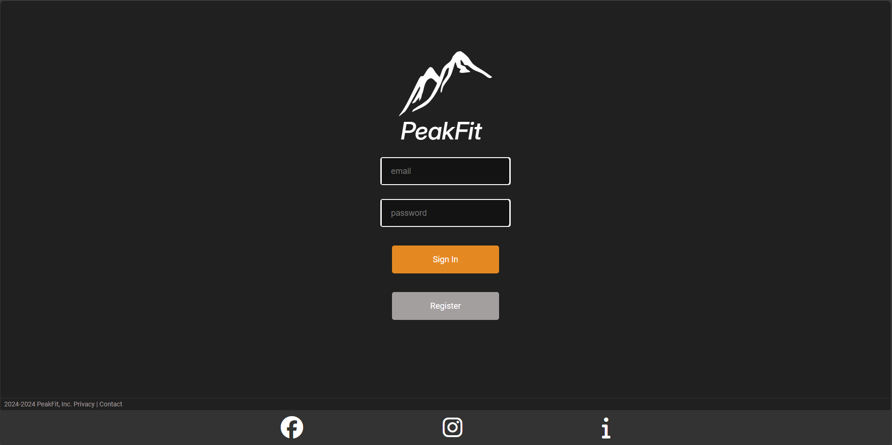
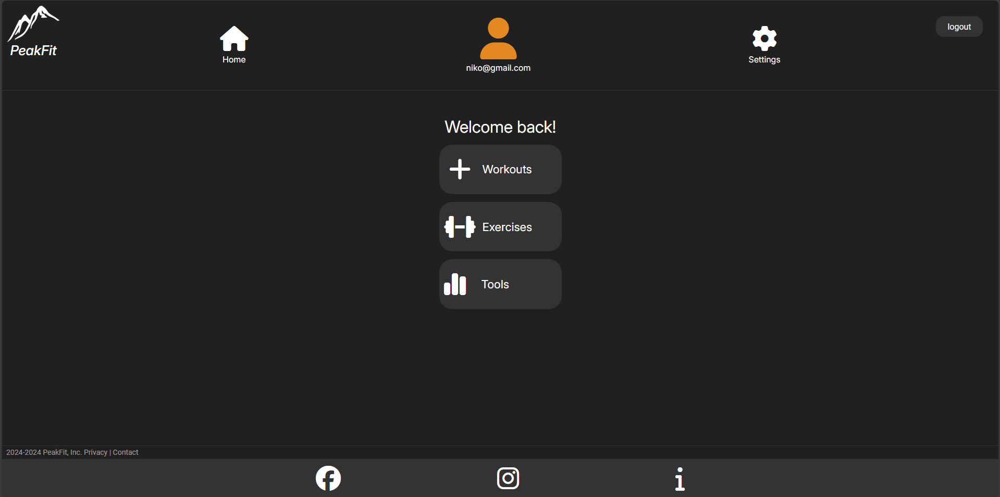
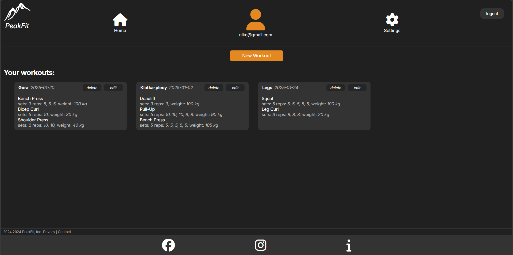
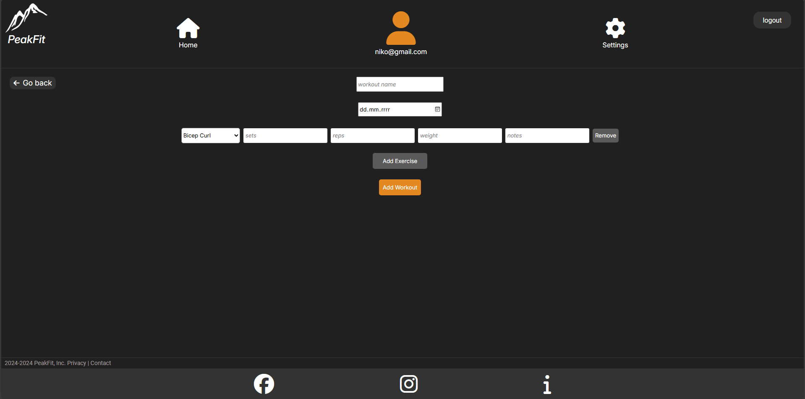
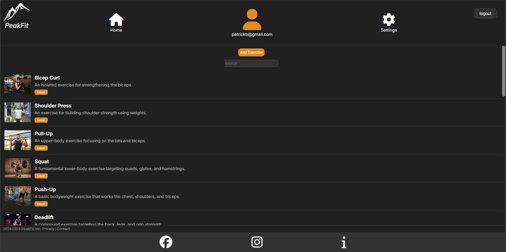
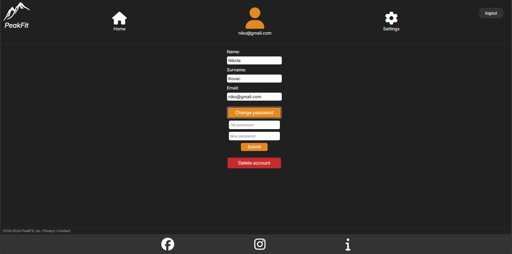
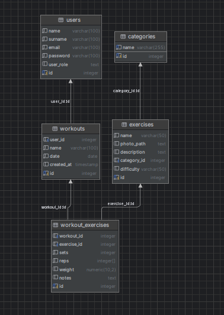

# PeakFit training app

## Description
The Peak Fit App is a modern fitness application designed to help users track workouts and achieve their fitness goals efficiently. It provides an intuitive platform for managing exercise routines and personalizing workouts.

## Key features

### Login 

### Main view  

### Workouts view

### Add workout

### Admin exercises managment

Admin can create and add exercises into general exercises database or remove them, unlike basic user.

### User settings

## Run 

-   App runs on docker,    requires both docker and docker-compose.

- Clone: https://github.com/szymekpro/wdpai_proj.git

- Build containers and start.

- Import postresql database file.

## DB UML

## File structure
- contents - fonts, readme readme files,
- db - database related stuff,
- docker - docker conf,
- images - images used in database paths etc;
- public - js, scripts, views - contain javascript files, php scripts and views,
- src - repositories, controllers and models,
- styles - css stylesheets,
- other files - either routing and entry point related or docker-compose file
